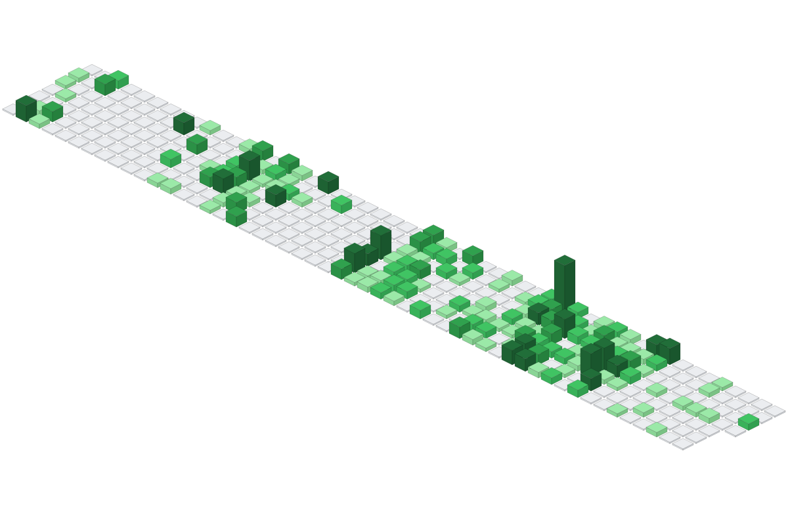

### I'm CatNum

- 💼 A Go backend engineer moving into Agent engineering.
- 🔬 Building controlled, observable, and evaluable AI Agent systems.
- 💬 Feel free to ask me anything on [GitHub](https://github.com/CatNum).
- 🧭 I believe in planning openly, executing safely, and verifying outcomes.
- 🏢 Focused on reliable backend systems, Agent orchestration, tool execution, tracing, and evaluation.

### ⌨️ Development Language

## 🖥 Technology Stack

## 🕰️ Recently I'm coding in...

## 📈 Contribution Timeline

 <picture>
  
</picture>

## 🐍 Contribution Snake

<picture>
    
</picture>

## 🏙️ Contribution City

<picture>
    
</picture>

<picture>
    <source media="(prefers-color-scheme: light)" srcset="https://raw.githubusercontent.com/CatNum/CatNum/output/pacman-contribution-graph.svg">
    
</picture>
